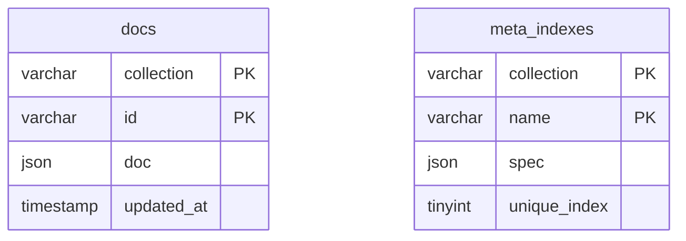
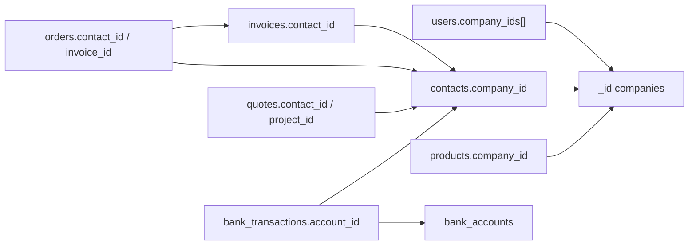

# TamKobi MySQL şema haritası

TamKobi, MongoDB koleksiyon API’sini (`db.invoices.find_one`, `update_one`, …) koruyarak veriyi **MySQL 8.0** üzerinde tutar. Fiziksel olarak neredeyse her iş kaydı tek bir tablodadır: `docs`. “Fatura tablosu”, “cari tablosu” gibi ilişkisel tablolar **yoktur**; bunlar `docs.collection` değerleridir.

Kaynaklar:

- Fiziksel DDL: [`backend/schema.mysql.sql`](../backend/schema.mysql.sql) (Docker init + bu belge)
- Runtime DDL: [`backend/mysql_store.py`](../backend/mysql_store.py) `SCHEMA_SQL` (API ayağa kalkınca `CREATE TABLE IF NOT EXISTS`)
- Koleksiyon kataloğu: [`backend/schema_catalog.py`](../backend/schema_catalog.py)
- Bağlantı: `DATABASE_URL` / `MYSQL_*` ([`backend/env.example`](../backend/env.example))

Yedekleme ve şema testleri: [`scripts/mysql_backup.sh`](../scripts/mysql_backup.sh), [`scripts/mysql_restore.sh`](../scripts/mysql_restore.sh), [`scripts/mysql_schema_test.sh`](../scripts/mysql_schema_test.sh).

---

## 1. Fiziksel şema

Veritabanı adı varsayılan **`tamkobi`**. Karakter seti **`utf8mb4`**, collation **`utf8mb4_unicode_ci`**, motor **InnoDB**.



### `docs`

| Kolon | Tip | Anlam |
|---|---|---|
| `collection` | `VARCHAR(128)` NOT NULL | Mantıksal koleksiyon adı (`invoices`, `contacts`, …) |
| `id` | `VARCHAR(191)` NOT NULL | Belge `_id` (UUID veya `comp_…` / `prod_01` gibi iş anahtarı) |
| `doc` | `JSON` NOT NULL | Belgenin tamamı; `_id` JSON içinde de saklanır |
| `updated_at` | `TIMESTAMP(6)` | `REPLACE`/`UPDATE` ile otomatik yenilenir |

**Birincil anahtar:** `(collection, id)`. Aynı `_id` iki koleksiyonda bulunabilir.

`id` 191 karakterle sınırlıdır: `utf8mb4` altında `191 × 4 = 764` bayt, eski InnoDB 767 bayt indeks limitinin altında kalır.

Yazma yolu (`mysql_store.MySQLCollection._save`):

```sql
REPLACE INTO docs (collection, id, doc) VALUES (%s, %s, %s)
```

`updated_at` SQL tarafında üretilir; JSON içindeki `created_at` / `updated_at` uygulama alanlarıdır.

### `meta_indexes`

Motor’un `create_index` karşılığı. **MySQL UNIQUE INDEX oluşturulmaz.** Benzersizlik `mysql_store._check_unique` ile Python’da denetlenir.

| Kolon | Tip | Anlam |
|---|---|---|
| `collection` | `VARCHAR(128)` | Hedef koleksiyon |
| `name` | `VARCHAR(191)` | İndeks adı (genelde alan adı) |
| `spec` | `JSON` | `{"fields": ["email"]}` |
| `unique_index` | `TINYINT(1)` | `1` = benzersiz |

API başlangıcında yazılan indeksler:

| Koleksiyon | Alan | Unique |
|---|---|---|
| `users` | `email` | evet |
| `products` | `sku` | hayır |
| `products` | `barcode` | hayır |
| `contacts` | `tax_number_or_id` | hayır |
| `invoices` | `invoice_number` | hayır |
| `orders` | `order_number` | hayır |
| `login_attempts` | `identifier` | hayır |

`sku` / `invoice_number` gibi alanlar **firma içinde** anlamlıdır; SQL unique olmadığı için aynı SKU iki şirkette bulunabilir. İzolasyon JSON `company_id` ile yapılır.

### Kiracı izolasyonu

SQL foreign key **yoktur**. Çoğu belgede `doc.company_id` vardır. Kullanıcılar `company_ids[]` + `active_company_id` ile firmalara bağlanır. Sorgular uygulama katmanında `{"company_id": ...}` filtresi ile yapılır; MySQL satır düzeyinde RLS yoktur.

---

## 2. Canlı ortamda görülebilen ekler

`schema.mysql.sql` yalnızca `docs` + `meta_indexes` tanımlar. Bu repodaki diğer feature branch’ler aynı MySQL örneğine ek nesneler yazmış olabilir. Bunlar **bu PR’ın parçası değildir**; yedek script hepsini olduğu gibi alır.

| Nesne | Kaynak (tipik) | Not |
|---|---|---|
| `docs.company_id` (STORED GENERATED) | `json_extract(doc,'$.company_id')` | Kiracı sorgularını hızlandırır |
| `idx_docs_coll_company` `(collection, company_id)` | performans | Opsiyonel |
| `idx_docs_coll_upd` `(collection, updated_at)` | artımlı senkron | Opsiyonel |
| Tablo `system_logs` | uygulama/auth/SQL log | İlişkisel log; JSON store değil |
| Koleksiyon `sync_tombstones` | silinen kayıt izi | `docs` içinde koleksiyon |

`SHOW CREATE TABLE` ile canlı DDL doğrulanır. Testler zorunlu tabloları arar; opsiyonel nesneler yoksa fail etmez.

---

## 3. Belge modeli

Her `doc` bir JSON objesidir:

- `_id` (string) = satır `docs.id`
- Zaman alanları ISO-8601 string (`created_at`) veya `YYYY-MM-DD` (`issue_date`)
- Para alanları float
- Satırlar gömülü dizi (`invoices.items`, `orders.items`, `recipes.materials`)
- Gizli alanlar `*_enc` / `password_hash` (Fernet / hash); yedek dosyası bunları da içerir — yedekleri şifreli diskte tutun

Motor operatörleri (`$set`, `$inc`, `$push`, `$regex`, …) satırın tamamını okuyup Python’da uygulanır, sonra `REPLACE` edilir. Bu yüzden `docs` üzerinde klasik 3NF join beklemeyin; raporlar koleksiyonu belleğe çeker veya JSON fonksiyonları kullanır.

Koleksiyon listesi: `SELECT DISTINCT collection FROM docs` veya `db.list_collection_names()`.

---

## 4. Mantıksal ilişkiler

Uygulama katmanı referansları (SQL FK değil):



Önemli bağlar:

| Kaynak | Alan | Hedef |
|---|---|---|
| `users` | `company_ids[]`, `active_company_id` | `companies._id` |
| `contacts` | `company_id` | `companies._id` |
| `invoices` | `contact_id` | `contacts._id` |
| `invoices.items[]` | `product_id` | `products._id` |
| `orders` | `contact_id`, `invoice_id` | `contacts`, `invoices` |
| `quotes` | `contact_id`, `project_id`, `survey_id`, `invoice_id` | ilgili koleksiyonlar |
| `surveys` | `quote_id`, `project_id` | `quotes`, `projects` |
| `bank_transactions` | `account_id`, `contact_id`, `related_invoice_id` | banka / cari / fatura |
| `installments` | `invoice_id`, `contact_id` | fatura / cari |
| `payrolls` | `employee_id` | `employees` |
| `production_orders` | `recipe_id`, `finished_product_id` | `recipes`, `products` |
| `work_orders` | `order_id` | `production_orders` |
| `cargo_shipments` | `order_id` | `orders` |
| `trash` | `doc` | silinen belgenin kopyası |
| `company_licenses` | `plan_id` | `saas_plans` |
| `companies` | `license_id` | `company_licenses` |

Keşif → teklif → proje: `surveys.quote_id` / `quotes.survey_id` / `quotes.project_id` / `projects`.

---

## 5. Koleksiyon kataloğu

Aşağıdaki listeler `schema_catalog.COLLECTIONS` ile aynıdır. Boş koleksiyonlar `docs`’ta satır olarak görünmez; kod ilk insert’te oluşur.

### Platform / SaaS

| Koleksiyon | Kapsam | Özet |
|---|---|---|
| `users` | platform | Giriş, rol, `company_ids`, tercihler |
| `companies` | platform | Firma kimliği, lisans, B2B/yazdırma ayarları |
| `roles` | kiracı | RBAC |
| `user_invites` | kiracı | Davet token |
| `login_attempts` | platform | Kilit |
| `activity_logs` | kiracı | Denetim izi |
| `platform_settings` | platform | `_id=platform` tek belge |
| `saas_plans` | platform | Paket / modül / kota |
| `company_licenses` | platform | Lisans dönemi |
| `payment_transactions` | platform | Stripe/PayTR |
| `upgrade_requests` | kiracı | Paket talebi |
| `license_reminders` | platform | Hatırlatma |
| `counters` | platform | Belge numarası `seq` |
| `platform_mail_servers` / `platform_mailboxes` | platform | Platform SMTP |
| `gib_wallets` / `gib_credit_ledger` | karışık | e-belge kontör |

### Cari, stok, satış

`contacts`, `products`, `product_categories`, `units`, `warehouses`, `warehouse_transfers`, `stock_movements`, `stock_counts`, `invoices`, `incoming_edocs`, `einvoice_settings`, `orders`, `order_pick_sessions`, `quotes`, `projects`, `surveys`, `installments`, `returns`.

**Contact tipi:** `customer` | `supplier` | `both`. B2B portal alanları cari belgesindedir (`b2b_enabled`, `b2b_token`, `b2b_password_hash`).

**Fatura:** `invoice_type` = `sales` | `purchase` | `proforma` | `return`; `e_type` = `e_invoice` | `e_archive` | `e_dispatch` | `paper`.

**Sipariş kanalı:** `manual`, `b2b`, pazaryerleri.

### Finans

`bank_accounts` (`bank` / `cash_box` / `pos`), `bank_transactions` (`inflow` / `outflow` / `transfer`), `bank_connections`, `bank_match_rules`, `cash_approval_requests`, `partners`, `partner_transactions`, `loans`, `expenses`, `expense_categories`, `expense_budgets`, `fx_rates`, `trade_files`.

### Personel ve üretim

`employees`, `payrolls`, `leave_requests`, `bonus_payments`, `attendance`, `attendance_alerts`, `shift_plans`, `shift_templates`, `recipes`, `production_orders`, `work_orders`.

### Entegrasyon ve iletişim

`integration_configs`, `marketplace_*`, `shopphp_push_logs`, `cargo_configs`, `cargo_shipments`, `cargo_auto_runs`, `sms_settings`, `sms_logs`, `mail_accounts`, `mail_logs`, `whatsapp_settings`, `whatsapp_logs`, `morning_summary_*`, `notifications`, `b2b_password_resets`, `b2b_product_aliases`, `pricing_rules`, `label_templates`.

### Dosya, çöp, migrasyon

`files` (blob diskte), `trash`, `migration_api_configs`, `migration_api_cache`, `migration_batches`, `migration_uploads`, `edoc_backups`, `edoc_backup_reminders`, `sync_tombstones`.

Alan listeleri ve referanslar için `schema_catalog.py` içindeki `keys` / `refs` bakın. Pydantic çekirdek modeller: [`backend/models.py`](../backend/models.py) (`User`, `Company`, `Contact`, `Product`, `Invoice`, `Order`, `BankAccount`, …). Kod, modellere girmeyen ek JSON alanları da yazar (`extra` yok sayılır; Mongo belgesi serbest şema).

---

## 6. Docker ve bağlantı

[`docker-compose.yml`](../docker-compose.yml) `mysql:8.0` ayağa kaldırır, `schema.mysql.sql` dosyasını `/docker-entrypoint-initdb.d/` altına bağlar (yalnızca **boş** data volume’da çalışır). Backend `MYSQL_HOST=mysql` ile bağlanır.

Yerel ajan / host: `127.0.0.1:3306`, kullanıcı `tamkobi`, veritabanı `tamkobi`. Root şifresi compose’ta `DB_PASSWORD` (varsayılan `tamkobi`).

---

## 7. Yedekleme

[`scripts/mysql_backup.sh`](../scripts/mysql_backup.sh) env’den bağlanır, tüm tabloları (üretilmiş kolonlar hariç) JSON snapshot + SQL dump olarak `MYSQL_BACKUP_DIR` (varsayılan `backups/mysql`) altına yazar ve `MYSQL_BACKUP_KEEP` (varsayılan 14) günden eski dosyaları siler.

```bash
# repo kökünden
./scripts/mysql_backup.sh
./scripts/mysql_backup.sh --dir /var/backups/tamkobi --keep 14
```

Cron örneği: [`scripts/mysql_backup.cron`](../scripts/mysql_backup.cron).

Geri yükleme **hedef veritabanını siler**. Canlı `tamkobi` üzerine yazmak için açık `--yes` ve doğru `MYSQL_DATABASE` gerekir. Test/geri alma için ayrı veritabanı kullanın:

```bash
MYSQL_DATABASE=tamkobi_restore_test MYSQL_USER=root MYSQL_PASSWORD=tamkobi \
  ./scripts/mysql_restore.sh backups/mysql/tamkobi-YYYYMMDD-HHMMSS.json.gz --yes
```

Yedek dosyaları git’e girmez (`backups/`). İçlerinde parola hash’leri ve `*_enc` alanları vardır.

---

## 8. Otomatik şema testleri

```bash
./scripts/mysql_schema_test.sh
```

Bu komut:

1. `schema.mysql.sql` ile `SCHEMA_SQL` gövdelerinin uyumunu kontrol eder
2. Katalogdaki çekirdek koleksiyonların kodda ve (erişilebilirse) canlı DB’de varlığını doğrular
3. Bir yedek alır, geçici `tamkobi_schema_test` veritabanına restore edip satır sayılarını karşılaştırır, sonra drop eder

Pytest hedefi: [`backend/tests/test_mysql_schema.py`](../backend/tests/test_mysql_schema.py) (`-n 0` ile xdist kapalı).
