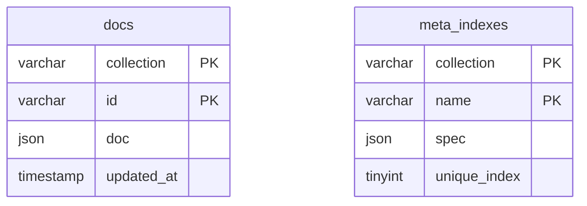
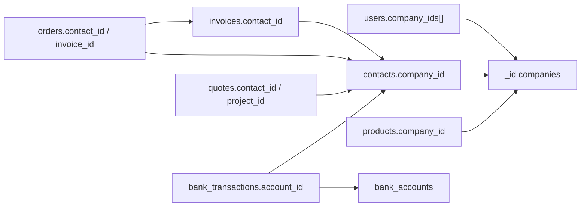

# TamKobi MySQL şema haritası

TamKobi, MongoDB koleksiyon API’sini (`db.invoices.find_one`, `update_one`, …) koruyarak veriyi **MySQL 8.0** üzerinde tutar. Fiziksel olarak neredeyse her iş kaydı tek bir tablodadır: `docs`. “Fatura tablosu”, “cari tablosu” gibi ilişkisel tablolar **yoktur**; bunlar `docs.collection` değerleridir.

Kaynaklar:

- Fiziksel DDL: [`backend/schema.mysql.sql`](../backend/schema.mysql.sql) (Docker init + bu belge)
- Runtime DDL: [`backend/mysql_store.py`](../backend/mysql_store.py) `SCHEMA_SQL` (API ayağa kalkınca `CREATE TABLE IF NOT EXISTS`)
- Koleksiyon kataloğu: [`backend/schema_catalog.py`](../backend/schema_catalog.py)
- Bağlantı: `DATABASE_URL` / `MYSQL_*` ([`backend/env.example`](../backend/env.example))

Yedekleme ve şema testleri: [`scripts/mysql_backup.sh`](../scripts/mysql_backup.sh), [`scripts/mysql_restore.sh`](../scripts/mysql_restore.sh), [`scripts/mysql_schema_test.sh`](../scripts/mysql_schema_test.sh).

---

## 1. Fiziksel şema

Veritabanı adı varsayılan **`tamkobi`**. Karakter seti **`utf8mb4`**, collation **`utf8mb4_unicode_ci`**, motor **InnoDB**.



### `docs`

| Kolon | Tip | Anlam |
|---|---|---|
| `collection` | `VARCHAR(128)` NOT NULL | Mantıksal koleksiyon adı (`invoices`, `contacts`, …) |
| `id` | `VARCHAR(191)` NOT NULL | Belge `_id` (UUID veya `comp_…` / `prod_01` gibi iş anahtarı) |
| `doc` | `JSON` NOT NULL | Belgenin tamamı; `_id` JSON içinde de saklanır |
| `updated_at` | `TIMESTAMP(6)` | `REPLACE`/`UPDATE` ile otomatik yenilenir |

**Birincil anahtar:** `(collection, id)`. Aynı `_id` iki koleksiyonda bulunabilir.

`id` 191 karakterle sınırlıdır: `utf8mb4` altında `191 × 4 = 764` bayt, eski InnoDB 767 bayt indeks limitinin altında kalır.

Yazma yolu (`mysql_store.MySQLCollection._save`):

```sql
REPLACE INTO docs (collection, id, doc) VALUES (%s, %s, %s)
```

`updated_at` SQL tarafında üretilir; JSON içindeki `created_at` / `updated_at` uygulama alanlarıdır.

### `meta_indexes`

Motor’un `create_index` karşılığı. **MySQL UNIQUE INDEX oluşturulmaz.** Benzersizlik `mysql_store._check_unique` ile Python’da denetlenir.

| Kolon | Tip | Anlam |
|---|---|---|
| `collection` | `VARCHAR(128)` | Hedef koleksiyon |
| `name` | `VARCHAR(191)` | İndeks adı (genelde alan adı) |
| `spec` | `JSON` | `{"fields": ["email"]}` |
| `unique_index` | `TINYINT(1)` | `1` = benzersiz |

API başlangıcında yazılan indeksler:

| Koleksiyon | Alan | Unique |
|---|---|---|
| `users` | `email` | evet |
| `products` | `sku` | hayır |
| `products` | `barcode` | hayır |
| `contacts` | `tax_number_or_id` | hayır |
| `invoices` | `invoice_number` | hayır |
| `orders` | `order_number` | hayır |
| `login_attempts` | `identifier` | hayır |

`sku` / `invoice_number` gibi alanlar **firma içinde** anlamlıdır; SQL unique olmadığı için aynı SKU iki şirkette bulunabilir. İzolasyon JSON `company_id` ile yapılır.

### Kiracı izolasyonu

SQL foreign key **yoktur**. Çoğu belgede `doc.company_id` vardır. Kullanıcılar `company_ids[]` + `active_company_id` ile firmalara bağlanır. Sorgular uygulama katmanında `{"company_id": ...}` filtresi ile yapılır; MySQL satır düzeyinde RLS yoktur.

---

## 2. Canlı ortamda görülebilen ekler

`schema.mysql.sql` yalnızca `docs` + `meta_indexes` tanımlar. Bu repodaki diğer feature branch’ler aynı MySQL örneğine ek nesneler yazmış olabilir. Bunlar **bu PR’ın parçası değildir**; yedek script hepsini olduğu gibi alır.

| Nesne | Kaynak (tipik) | Not |
|---|---|---|
| `docs.company_id` (STORED GENERATED) | `json_extract(doc,'$.company_id')` | Kiracı sorgularını hızlandırır |
| `idx_docs_coll_company` `(collection, company_id)` | performans | Opsiyonel |
| `idx_docs_coll_upd` `(collection, updated_at)` | artımlı senkron | Opsiyonel |
| Tablo `system_logs` | uygulama/auth/SQL log | İlişkisel log; JSON store değil |
| Koleksiyon `sync_tombstones` | silinen kayıt izi | `docs` içinde koleksiyon |

`SHOW CREATE TABLE` ile canlı DDL doğrulanır. Testler zorunlu tabloları arar; opsiyonel nesneler yoksa fail etmez.

---

## 3. Belge modeli

Her `doc` bir JSON objesidir:

- `_id` (string) = satır `docs.id`
- Zaman alanları ISO-8601 string (`created_at`) veya `YYYY-MM-DD` (`issue_date`)
- Para alanları float
- Satırlar gömülü dizi (`invoices.items`, `orders.items`, `recipes.materials`)
- Gizli alanlar `*_enc` / `password_hash` (Fernet / hash); yedek dosyası bunları da içerir — yedekleri şifreli diskte tutun

Motor operatörleri (`$set`, `$inc`, `$push`, `$regex`, …) satırın tamamını okuyup Python’da uygulanır, sonra `REPLACE` edilir. Bu yüzden `docs` üzerinde klasik 3NF join beklemeyin; raporlar koleksiyonu belleğe çeker veya JSON fonksiyonları kullanır.

Koleksiyon listesi: `SELECT DISTINCT collection FROM docs` veya `db.list_collection_names()`.

---

## 4. Mantıksal ilişkiler

Uygulama katmanı referansları (SQL FK değil):



Önemli bağlar:

| Kaynak | Alan | Hedef |
|---|---|---|
| `users` | `company_ids[]`, `active_company_id` | `companies._id` |
| `contacts` | `company_id` | `companies._id` |
| `invoices` | `contact_id` | `contacts._id` |
| `invoices.items[]` | `product_id` | `products._id` |
| `orders` | `contact_id`, `invoice_id` | `contacts`, `invoices` |
| `quotes` | `contact_id`, `project_id`, `survey_id`, `invoice_id` | ilgili koleksiyonlar |
| `surveys` | `quote_id`, `project_id` | `quotes`, `projects` |
| `bank_transactions` | `account_id`, `contact_id`, `related_invoice_id` | banka / cari / fatura |
| `installments` | `invoice_id`, `contact_id` | fatura / cari |
| `payrolls` | `employee_id` | `employees` |
| `production_orders` | `recipe_id`, `finished_product_id` | `recipes`, `products` |
| `work_orders` | `order_id` | `production_orders` |
| `cargo_shipments` | `order_id` | `orders` |
| `trash` | `doc` | silinen belgenin kopyası |
| `company_licenses` | `plan_id` | `saas_plans` |
| `companies` | `license_id` | `company_licenses` |

Keşif → teklif → proje: `surveys.quote_id` / `quotes.survey_id` / `quotes.project_id` / `projects`.

---

## 5. Koleksiyon kataloğu

Aşağıdaki listeler `schema_catalog.COLLECTIONS` ile aynıdır. Boş koleksiyonlar `docs`’ta satır olarak görünmez; kod ilk insert’te oluşur.

### Platform / SaaS

| Koleksiyon | Kapsam | Özet |
|---|---|---|
| `users` | platform | Giriş, rol, `company_ids`, tercihler |
| `companies` | platform | Firma kimliği, lisans, B2B/yazdırma ayarları |
| `roles` | kiracı | RBAC |
| `user_invites` | kiracı | Davet token |
| `login_attempts` | platform | Kilit |
| `activity_logs` | kiracı | Denetim izi |
| `platform_settings` | platform | `_id=platform` tek belge |
| `saas_plans` | platform | Paket / modül / kota |
| `company_licenses` | platform | Lisans dönemi |
| `payment_transactions` | platform | Stripe/PayTR |
| `upgrade_requests` | kiracı | Paket talebi |
| `license_reminders` | platform | Hatırlatma |
| `counters` | platform | Belge numarası `seq` |
| `platform_mail_servers` / `platform_mailboxes` | platform | Platform SMTP |
| `gib_wallets` / `gib_credit_ledger` | karışık | e-belge kontör |

### Cari, stok, satış

`contacts`, `products`, `product_categories`, `units`, `warehouses`, `warehouse_transfers`, `stock_movements`, `stock_counts`, `invoices`, `incoming_edocs`, `einvoice_settings`, `orders`, `order_pick_sessions`, `quotes`, `projects`, `surveys`, `installments`, `returns`.

**Contact tipi:** `customer` | `supplier` | `both`. B2B portal alanları cari belgesindedir (`b2b_enabled`, `b2b_token`, `b2b_password_hash`).

**Fatura:** `invoice_type` = `sales` | `purchase` | `proforma` | `return`; `e_type` = `e_invoice` | `e_archive` | `e_dispatch` | `paper`.

**Sipariş kanalı:** `manual`, `b2b`, pazaryerleri.

### Finans

`bank_accounts` (`bank` / `cash_box` / `pos`), `bank_transactions` (`inflow` / `outflow` / `transfer`), `bank_connections`, `bank_match_rules`, `cash_approval_requests`, `partners`, `partner_transactions`, `loans`, `expenses`, `expense_categories`, `expense_budgets`, `fx_rates`, `trade_files`.

### Personel ve üretim

`employees`, `payrolls`, `leave_requests`, `bonus_payments`, `attendance`, `attendance_alerts`, `shift_plans`, `shift_templates`, `recipes`, `production_orders`, `work_orders`.

### Entegrasyon ve iletişim

`integration_configs`, `marketplace_*`, `shopphp_push_logs`, `cargo_configs`, `cargo_shipments`, `cargo_auto_runs`, `sms_settings`, `sms_logs`, `mail_accounts`, `mail_logs`, `whatsapp_settings`, `whatsapp_logs`, `morning_summary_*`, `notifications`, `b2b_password_resets`, `b2b_product_aliases`, `pricing_rules`, `label_templates`.

### Dosya, çöp, migrasyon

`files` (blob diskte), `trash`, `migration_api_configs`, `migration_api_cache`, `migration_batches`, `migration_uploads`, `edoc_backups`, `edoc_backup_reminders`, `sync_tombstones`.

Alan listeleri ve referanslar için `schema_catalog.py` içindeki `keys` / `refs` bakın. Pydantic çekirdek modeller: [`backend/models.py`](../backend/models.py) (`User`, `Company`, `Contact`, `Product`, `Invoice`, `Order`, `BankAccount`, …). Kod, modellere girmeyen ek JSON alanları da yazar (`extra` yok sayılır; Mongo belgesi serbest şema).

---

## 6. Docker ve bağlantı

[`docker-compose.yml`](../docker-compose.yml) `mysql:8.0` ayağa kaldırır, `schema.mysql.sql` dosyasını `/docker-entrypoint-initdb.d/` altına bağlar (yalnızca **boş** data volume’da çalışır). Backend `MYSQL_HOST=mysql` ile bağlanır.

Yerel ajan / host: `127.0.0.1:3306`, kullanıcı `tamkobi`, veritabanı `tamkobi`. Root şifresi compose’ta `DB_PASSWORD` (varsayılan `tamkobi`).

---

## 7. Yedekleme

[`scripts/mysql_backup.sh`](../scripts/mysql_backup.sh) env’den bağlanır, tüm tabloları (üretilmiş kolonlar hariç) JSON snapshot + SQL dump olarak `MYSQL_BACKUP_DIR` (varsayılan `backups/mysql`) altına yazar ve `MYSQL_BACKUP_KEEP` (varsayılan 14) günden eski dosyaları siler.

```bash
# repo kökünden
./scripts/mysql_backup.sh
./scripts/mysql_backup.sh --dir /var/backups/tamkobi --keep 14
```

Cron örneği: [`scripts/mysql_backup.cron`](../scripts/mysql_backup.cron).

Geri yükleme **hedef veritabanını siler**. Canlı `tamkobi` üzerine yazmak için açık `--yes` ve doğru `MYSQL_DATABASE` gerekir. Test/geri alma için ayrı veritabanı kullanın:

```bash
MYSQL_DATABASE=tamkobi_restore_test MYSQL_USER=root MYSQL_PASSWORD=tamkobi \
  ./scripts/mysql_restore.sh backups/mysql/tamkobi-YYYYMMDD-HHMMSS.json.gz --yes
```

Yedek dosyaları git’e girmez (`backups/`). İçlerinde parola hash’leri ve `*_enc` alanları vardır.

---

## 8. Otomatik şema testleri

```bash
./scripts/mysql_schema_test.sh
```

Bu komut:

1. `schema.mysql.sql` ile `SCHEMA_SQL` gövdelerinin uyumunu kontrol eder
2. Katalogdaki çekirdek koleksiyonların kodda ve (erişilebilirse) canlı DB’de varlığını doğrular
3. Bir yedek alır, geçici `tamkobi_schema_test` veritabanına restore edip satır sayılarını karşılaştırır, sonra drop eder

Pytest hedefi: [`backend/tests/test_mysql_schema.py`](../backend/tests/test_mysql_schema.py) (`-n 0` ile xdist kapalı).
# TamKobi MySQL schema map

Generated: `2026-09-08T19:57:07.387372+00:00` · `127.0.0.1:3306/tamkobi`

TamKobi does **not** use one SQL table per entity. Application documents
(invoices, contacts, users, …) live as JSON rows in `docs`, keyed by
`(collection, id)`. `meta_indexes` stores uniqueness rules enforced in Python.
`system_logs` is a native relational audit table.

## Physical tables

### `docs`

- Engine: InnoDB · Collation: utf8mb4_unicode_ci
- Approx rows: 1527 · data 2.516 MB · indexes 0.0 MB

```sql
CREATE TABLE `docs` (
  `collection` varchar(128) COLLATE utf8mb4_unicode_ci NOT NULL,
  `id` varchar(191) COLLATE utf8mb4_unicode_ci NOT NULL,
  `doc` json NOT NULL,
  `updated_at` timestamp(6) NOT NULL DEFAULT CURRENT_TIMESTAMP(6) ON UPDATE CURRENT_TIMESTAMP(6),
  `company_id` varchar(64) COLLATE utf8mb4_unicode_ci GENERATED ALWAYS AS (json_unquote(json_extract(`doc`,_utf8mb4'$.company_id'))) STORED,
  PRIMARY KEY (`collection`,`id`),
  KEY `idx_docs_coll_company` (`collection`,`company_id`)
) ENGINE=InnoDB DEFAULT CHARSET=utf8mb4 COLLATE=utf8mb4_unicode_ci
```

### `meta_indexes`

- Engine: InnoDB · Collation: utf8mb4_unicode_ci
- Approx rows: 7 · data 0.016 MB · indexes 0.0 MB

```sql
CREATE TABLE `meta_indexes` (
  `collection` varchar(128) COLLATE utf8mb4_unicode_ci NOT NULL,
  `name` varchar(191) COLLATE utf8mb4_unicode_ci NOT NULL,
  `spec` json NOT NULL,
  `unique_index` tinyint(1) NOT NULL DEFAULT '0',
  PRIMARY KEY (`collection`,`name`)
) ENGINE=InnoDB DEFAULT CHARSET=utf8mb4 COLLATE=utf8mb4_unicode_ci
```

### `system_logs`

- Engine: InnoDB · Collation: utf8mb4_unicode_ci
- Approx rows: 2 · data 0.016 MB · indexes 0.062 MB

```sql
CREATE TABLE `system_logs` (
  `id` bigint unsigned NOT NULL AUTO_INCREMENT,
  `created_at` timestamp(6) NOT NULL DEFAULT CURRENT_TIMESTAMP(6),
  `level` varchar(16) COLLATE utf8mb4_unicode_ci NOT NULL,
  `category` varchar(32) COLLATE utf8mb4_unicode_ci NOT NULL,
  `event` varchar(64) COLLATE utf8mb4_unicode_ci NOT NULL,
  `user_id` varchar(64) COLLATE utf8mb4_unicode_ci DEFAULT NULL,
  `user_email` varchar(191) COLLATE utf8mb4_unicode_ci DEFAULT NULL,
  `company_id` varchar(64) COLLATE utf8mb4_unicode_ci DEFAULT NULL,
  `ip` varchar(64) COLLATE utf8mb4_unicode_ci DEFAULT NULL,
  `method` varchar(16) COLLATE utf8mb4_unicode_ci DEFAULT NULL,
  `path` varchar(512) COLLATE utf8mb4_unicode_ci DEFAULT NULL,
  `status_code` smallint DEFAULT NULL,
  `duration_ms` int DEFAULT NULL,
  `collection_name` varchar(128) COLLATE utf8mb4_unicode_ci DEFAULT NULL,
  `message` text COLLATE utf8mb4_unicode_ci NOT NULL,
  `details` json DEFAULT NULL,
  PRIMARY KEY (`id`),
  KEY `idx_syslogs_created` (`created_at`),
  KEY `idx_syslogs_cat_created` (`category`,`created_at`),
  KEY `idx_syslogs_user` (`user_email`,`created_at`),
  KEY `idx_syslogs_event` (`event`,`created_at`)
) ENGINE=InnoDB AUTO_INCREMENT=3 DEFAULT CHARSET=utf8mb4 COLLATE=utf8mb4_unicode_ci
```

## JSON collections (`docs.collection`)

Each collection is a logical Mongo-style table. Reads historically scanned
the whole collection in Python; `company_id` equality now uses the generated
column + `idx_docs_coll_company`.

### SaaS / platform

| collection | rows | KB | sample fields |
|---|---:|---:|---|
| `users` | 34 | 12.8 | `_id`, `active_company_id`, `company_ids`, `created_at`, `email`, `is_active`, `name`, `password_hash`, `preferences`, `role` |
| `companies` | 40 | 12.9 | `_id`, `address`, `city`, `created_at`, `currency`, `email`, `license_id`, `name`, `phone`, `tax_number`, `tax_office` |
| `company_licenses` | 150 | 49.7 | `_id`, `created_at`, `expires_at`, `module_overrides`, `notes`, `plan_id`, `started_at`, `status`, `trial_ends_at`, `user_limit` |
| `saas_plans` | 4 | 2.5 | `_id`, `code`, `color`, `company_limit`, `created_at`, `is_public`, `modules`, `name`, `price_monthly`, `price_yearly`, `sort`, `tagline` |
| `roles` | 242 | 168.7 | `_id`, `code`, `company_id`, `created_at`, `is_system`, `name`, `permissions` |
| `user_invites` | 3 | 1.9 | `_id`, `accepted_at`, `company_id`, `company_name`, `created_at`, `email`, `employee_id`, `expires_at`, `invited_by`, `link`, `mail`, `name` |
| `platform_settings` | 1 | 1.0 | `_id`, `ai`, `brand_name`, `created_at`, `currency`, `email_enabled`, `gib_packs`, `public_url`, `reminder_days`, `sender_company_id`, `support_email`, `support_phone` |
| `platform_mail_servers` | 1 | 0.4 | `_id`, `created_at`, `is_active`, `name`, `password_enc`, `provider`, `smtp_host`, `smtp_port`, `smtp_user`, `updated_at` |
| `platform_mailboxes` | 1 | 0.4 | `_id`, `allow_all_admins`, `allowed_user_ids`, `created_at`, `created_by`, `display_name`, `email`, `is_active`, `is_default`, `purposes`, `reply_to`, `server_id` |
| `upgrade_requests` | 2 | 0.7 | `_id`, `admin_note`, `company_id`, `company_name`, `created_at`, `message`, `modules`, `plan_id`, `plan_name`, `requested_by`, `resolved_at`, `status` |
| `login_attempts` | 13 | 2.0 | `_id`, `count`, `identifier`, `last_attempt` |

### Muhasebe

| collection | rows | KB | sample fields |
|---|---:|---:|---|
| `invoices` | 45 | 45.0 | `_id`, `company_id`, `contact_id`, `contact_name`, `created_at`, `currency`, `direction`, `discount_total`, `e_type`, `fx_rate`, `general_discount_amount`, `general_discount_rate` |
| `contacts` | 26 | 15.1 | `_id`, `b2b_discount`, `b2b_enabled`, `balance`, `category`, `company_id`, `created_at`, `credit_limit`, `currency`, `default_discount`, `email_opt_in`, `is_e_invoice_user` |
| `installments` | 8 | 3.9 | `_id`, `amount`, `company_id`, `contact_id`, `contact_name`, `created_at`, `direction`, `due_date`, `invoice_id`, `invoice_number`, `invoice_type`, `label` |
| `expenses` | 6 | 3.9 | `_id`, `account_id`, `account_name`, `amount`, `category`, `company_id`, `contact_id`, `contact_name`, `created_at`, `currency`, `date`, `description` |
| `expense_categories` | 1 | 0.1 | `_id`, `company_id`, `created_at`, `name` |
| `expense_budgets` | 1 | 0.2 | `_id`, `category`, `company_id`, `monthly_limit`, `updated_at` |
| `quotes` | 6 | 4.8 | `_id`, `company_id`, `contact_id`, `contact_name`, `created_at`, `currency`, `grand_total`, `images`, `invoice_id`, `issue_date`, `items`, `notes` |
| `trade_files` | 6 | 7.2 | `_id`, `amount_fx`, `amount_try`, `bl_awb`, `certificate`, `cif`, `company_id`, `contact_id`, `contact_name`, `container_no`, `country`, `created_at` |

### Finans

| collection | rows | KB | sample fields |
|---|---:|---:|---|
| `bank_accounts` | 13 | 4.3 | `_id`, `account_name`, `account_number`, `bank_name`, `company_id`, `created_at`, `currency`, `current_balance`, `iban`, `pos_commission_rate`, `type` |
| `bank_transactions` | 22 | 9.6 | `_id`, `account_id`, `account_name`, `amount`, `category`, `company_id`, `created_at`, `currency`, `date`, `description`, `partner_tx_id`, `source` |
| `partners` | 2 | 0.7 | `_id`, `balance`, `company_id`, `created_at`, `email`, `is_active`, `is_demo`, `name`, `phone`, `share_percent`, `total_capital_in`, `total_profit_share` |
| `partner_transactions` | 18 | 7.1 | `_id`, `amount`, `company_id`, `created_at`, `date`, `description`, `is_demo`, `is_paid`, `partner_id`, `partner_name`, `type` |
| `cash_approval_requests` | 4 | 2.7 | `_id`, `account_ids`, `approved_at`, `approved_by`, `approved_by_name`, `company_id`, `created_at`, `kind`, `payload`, `requested_by`, `requested_by_email`, `requested_by_name` |
| `fx_rates` | 3 | 1.0 | `_id`, `bulletin_url`, `buying`, `company_id`, `created_at`, `currency`, `date`, `name`, `rate`, `selling`, `source`, `unit` |
| `gib_wallets` | 4 | 0.6 | `_id`, `balance`, `created_at`, `updated_at` |
| `gib_credit_ledger` | 11 | 2.7 | `_id`, `company_id`, `created_at`, `credits`, `note`, `type`, `wallet_id` |

### Satış / sipariş

| collection | rows | KB | sample fields |
|---|---:|---:|---|
| `orders` | 32 | 28.4 | `_id`, `approved_at`, `channel`, `city`, `company_id`, `contact_id`, `contact_name`, `currency`, `customer_name`, `is_invoiced`, `items`, `order_date` |
| `order_pick_sessions` | 10 | 8.8 | `_id`, `city`, `company_id`, `complete_mode`, `completed_at`, `created_at`, `customer_name`, `items`, `last_scan`, `notified_missing_at`, `order_id`, `order_number` |
| `projects` | 1 | 0.6 | `_id`, `address`, `budget`, `company_id`, `contact_id`, `contact_name`, `created_at`, `description`, `end_date`, `images`, `invoice_id`, `invoice_number` |
| `surveys` | 5 | 2.7 | `_id`, `address`, `assigned_to`, `company_id`, `contact_id`, `contact_name`, `created_at`, `images`, `latitude`, `location_url`, `longitude`, `measurements` |
| `cargo_configs` | 4 | 1.1 | `_id`, `api_password`, `api_username`, `auto_create_barcode`, `carrier_code`, `carrier_name`, `company_id`, `customer_number`, `is_active`, `is_demo`, `status` |
| `cargo_shipments` | 1 | 0.4 | `_id`, `address`, `barcode`, `carrier_code`, `carrier_name`, `city`, `company_id`, `customer_name`, `estimated_delivery`, `is_live`, `shipment_date`, `status` |

### Stok / üretim

| collection | rows | KB | sample fields |
|---|---:|---:|---|
| `products` | 18 | 11.2 | `_id`, `barcode`, `category`, `company_id`, `created_at`, `currency`, `has_recipe`, `has_variants`, `images`, `is_active`, `min_stock_alert`, `name` |
| `product_categories` | 5 | 0.7 | `_id`, `company_id`, `created_at`, `name` |
| `units` | 86 | 8.0 | `_id`, `company_id`, `name` |
| `warehouses` | 4 | 1.0 | `_id`, `code`, `company_id`, `created_at`, `is_default`, `is_demo`, `location`, `manager_name`, `name` |
| `stock_movements` | 27 | 8.2 | `_id`, `change`, `date`, `new_stock`, `product_id`, `product_name`, `reason`, `variant_id`, `variant_name` |
| `stock_counts` | 2 | 1.0 | `_id`, `company_id`, `completed_at`, `created_at`, `items`, `name`, `status`, `warehouse_id`, `warehouse_name` |
| `recipes` | 4 | 3.0 | `_id`, `code`, `company_id`, `created_at`, `finished_product_id`, `finished_product_name`, `is_active`, `labor_cost`, `material_cost`, `materials`, `name`, `notes` |
| `production_orders` | 3 | 1.9 | `_id`, `company_id`, `completed_quantity`, `created_at`, `end_date`, `finished_product_id`, `finished_product_name`, `notes`, `order_code`, `planned_date`, `planned_quantity`, `recipe_id` |
| `work_orders` | 3 | 2.5 | `_id`, `assigned_name`, `assigned_to`, `company_id`, `created_at`, `duration_min`, `finished_at`, `logs`, `notes`, `operator_name`, `order_code`, `order_id` |
| `label_templates` | 1 | 0.9 | `_id`, `company_id`, `created_at`, `elements`, `height_mm`, `is_default`, `name`, `page`, `width_mm` |

### İK

| collection | rows | KB | sample fields |
|---|---:|---:|---|
| `employees` | 3 | 1.7 | `_id`, `annual_leave_days`, `company_id`, `created_at`, `department`, `email`, `full_name`, `is_demo`, `meal_allowance`, `phone`, `position`, `salary` |
| `payrolls` | 5 | 2.7 | `_id`, `advance_payment`, `bonus`, `company_id`, `created_at`, `deduction`, `employee_id`, `employee_name`, `final_payable`, `gross_salary`, `is_demo`, `net_salary` |
| `leave_requests` | 4 | 1.5 | `_id`, `company_id`, `created_at`, `days`, `decided_at`, `decision_note`, `employee_id`, `employee_name`, `end_date`, `reason`, `start_date`, `status` |
| `bonus_payments` | 2 | 0.7 | `_id`, `account_id`, `account_name`, `amount`, `company_id`, `created_at`, `employee_id`, `employee_name`, `is_official`, `note`, `period`, `status` |
| `attendance_alerts` | 2 | 0.3 | `_id`, `company_id`, `created_at`, `type` |

### Entegrasyon

| collection | rows | KB | sample fields |
|---|---:|---:|---|
| `integration_configs` | 7 | 3.1 | `_id`, `api_key`, `api_secret`, `auto_create_invoice`, `auto_sync_orders`, `auto_sync_stock`, `channel`, `channel_name`, `company_id`, `is_active`, `is_demo`, `last_synced_at` |
| `einvoice_settings` | 2 | 0.8 | `_id`, `alias`, `api_url`, `assigned_at`, `company_id`, `corporate_code`, `mode`, `password_enc`, `provider`, `status`, `updated_at`, `username` |
| `migration_api_configs` | 1 | 0.5 | `_id`, `company_id`, `firm_id`, `last_test`, `provider`, `token_enc`, `token_tail`, `updated_at` |
| `migration_api_cache` | 1 | 1052.2 | `_id`, `company_id`, `fetched_at`, `items`, `kind`, `provider` |

### Sistem

| collection | rows | KB | sample fields |
|---|---:|---:|---|
| `activity_logs` | 676 | 210.6 | `_id`, `company_id`, `created_at`, `ip`, `method`, `module`, `path`, `status`, `user_id`, `user_name` |
| `notifications` | 42 | 16.5 | `_id`, `company_id`, `created_at`, `is_read`, `message`, `ref_id`, `ref_type`, `title`, `type` |
| `trash` | 95 | 99.2 | `_id`, `collection`, `company_id`, `deleted_at`, `deleted_by`, `doc`, `entity_type`, `expires_at`, `label`, `note`, `related` |
| `counters` | 21 | 1.0 | `_id`, `seq` |

## Application indexes (`meta_indexes`)

These are **not** InnoDB indexes (except `users.email` uniqueness checked in app).
They prevent duplicate JSON documents on write.

| collection | name | unique | fields |
|---|---|---|---|
| `contacts` | `tax_number_or_id` | False | `tax_number_or_id` |
| `invoices` | `invoice_number` | False | `invoice_number` |
| `login_attempts` | `identifier` | False | `identifier` |
| `orders` | `order_number` | False | `order_number` |
| `products` | `barcode` | False | `barcode` |
| `products` | `sku` | False | `sku` |
| `users` | `email` | True | `email` |

## Query pattern

1. `SELECT doc FROM docs WHERE collection=? [AND company_id=?]`
2. Filter/sort remaining predicates in Python (`match_query` / `sort_docs`).
3. Writes: `INSERT` / `REPLACE` / `DELETE` on `(collection, id)`.

See `docs/mysql-performance-report.md` for load, buffer pool, and scaling.
